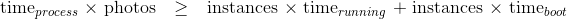
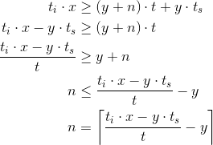
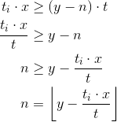

A photo processing site's biggest maintenance cost is maintaining EC2 images
for photo processing and downloading. We can mitigate some of this cost by
automatically scaling the number of concurrent EC2 instances. For some
background on automated scaling, see:

 * http://broadcast.oreilly.com/2008/12/why-i-dont-like-cloud-auto-scaling.html
 * http://www.elasticvapor.com/2008/12/cloud-scaling-dynamic-vs-auto-scaling.html

Photo processing is a unique case where auto-scaling can work quite well. When
the number of photos in the queue increases, we can spawn several EC2 instances
to churn through them quickly. When the queue level drops, we can automatically
shut down the extra EC2 instances. Since photo processing is neither
time-sensitive nor foreseeable, the arguments against auto-scaling do not hold.

Starting Instances
==================
Adding EC2 instances must be worthwhile. The time it takes a new EC2 instance
to start must not be greater than the time saved by starting the instance. It
also doesn't make sense to start an instance and then have it finish and shut
down almost instantly. The instance should run for at time period of least as
long as it takes to start.

Once up and running, an instance takes a certain time to process each photo.
Instances also have a startup time. Using these variables, it is only worth
starting new instances when the following condition is met:



When this condition is met, we can calculate how many instances to start. Let:

 * **n**             be the number of instances to start (computers)
 * **x**             be the number of photos to process (photos)
 * **y**             be the number of instances running (computers)
 * **t<sub>i</sub>** be the computer time to process one photo (computer-seconds per photo)
 * **t<sub>s</sub>** be the time to start an instance (seconds)
 * **t**             be the desired time to completion after the new instances have started (seconds)



The above formula ensures that when the queue gets overloaded, it will only
take about **t<sub>s</sub> + t** seconds to clear out. If the initial
condition is not met, **n** (the number of instances to start) will be **≤ 0**.

Stopping Instances
==================
With automated scaling and important aspect is to ensure instances are not
running when no work is being done. If there is an error that prevents
processing and we strictly use the above formula, we will keep creating
instances and never shut them down. There are three approaches to prevent
over-creating EC2 instances: governors, automatic down-scaling and monitoring.

Governors
---------
There should be a maximum number of instances that can ever run concurrently.
This is a hard limit and can correlate to the speed at which we can receive
processed photo requests on the system's internal infrastructure.

Automatic Down-Scaling
----------------------
We check if instances are no longer needed and can be shut down without
significantly slowing down photo processing. The number of instances that can
be stopped can be calculated from a modification of the above formula.
Modification is required, because it takes no time to stop an instance whereas
it takes **t<sub>s</sub>** time to start an instance. Let:

 * **n**             be the number of instances to stop (computers)
 * **x**             be the number of photos to process (photos)
 * **y**             be the number of instances running (computers)
 * **t<sub>i</sub>** be the computer time to process one photo (computer-seconds per photo)
 * **t**             be the desired time to completion after the instances have stopped (seconds)



Monitoring
==========
Instances must be doing work. If the number of processed photos in the system
is not increasing *and* the queue is not decreasing, we can shut down all
instances. Most likely, an error got pushed to the EC2 images and no photos are
being processed. Detecting this situation requires monitoring change and will
require at least two data points before an action can be taken.

In this situation, an email will be sent to the developers notifying them the
system has shut down.

Monitoring Instances
--------------------
A monitoring script will run on cron to check whether instances need to be
started or stopped. The following variables need to be checked:

 1. number of running instances
 2. number of unprocessed photos in the queue
 3. number of processed photos in the database

The number of running instances and number of unprocessed photos each incur a
fee from Amazon. Based on a ten-minute period, this will result in 8,640
requests. This will be billed at about $0.02 a month (practically nothing).

Dynamic Variables
-----------------
Instead of time estimates for automated scaling variables, we can average
actual times for EC2 operations. This will provide better estimates in an
automated fashion. The averages to be tracked are:

 * instance start time (**t<sub>s</sub>**)
 * photo processing time (**t<sub>i</sub>**)
 * photo downloading time (**t<sub>i</sub>**)

Instance start time is tracked by the instance sending a message via SQS when
it starts. The EC2 manager script is responsible for checking this queue for
messages and for maintaining a running average of EC2 instance start time.

The processing and downloading times are also passed via the respective queue
messages on a per-image basis. The times can be stored in the Photo table and
an average can be calculated using the ```avg()``` aggregate function in SQL:

```sql
select avg(processing_time) from Photo
where processing_time  is not null;

select avg(downloading_time) from Photo
where downloading_time is not null;
```

We can enhance this further by averaging the times from only the last **x**
photos. That way if the speed of the fundamental operations (downloading and
processing) changes, EC2 scaling will be adjusted quicker. For example:

```sql
select avg(processing_time) from Photo
where id in (select id from Photo order by id desc limit 2000)
    and processing_time is not null;

select avg(downloading_time) from Photo
where id in (select id from Photo order by id desc limit 2000)
    and downloading_time is not null;
```
